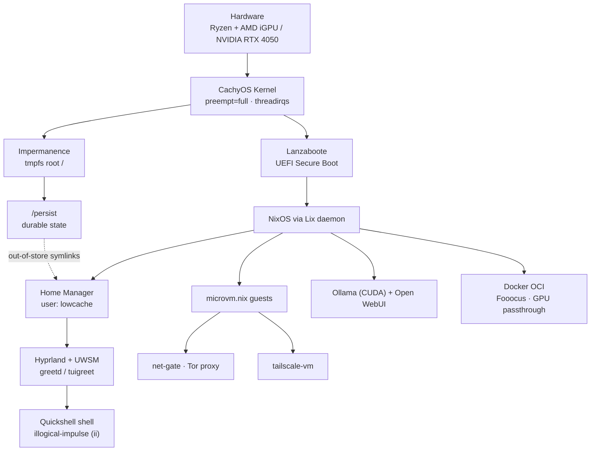
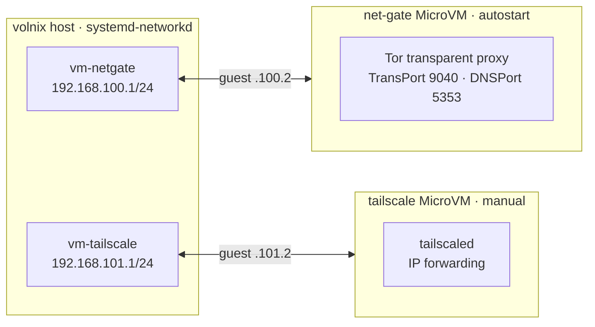
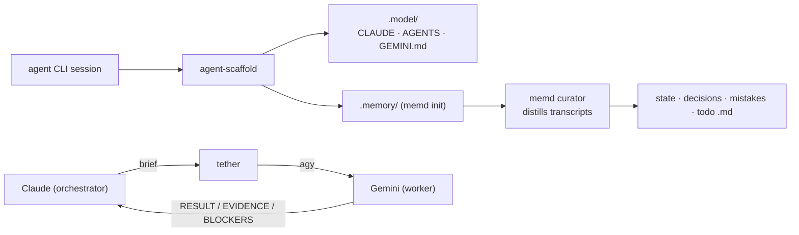

<div align="center">


<p>
  
  
  
  
</p>
<p>
  
  
  
  
  
  <a href="https://github.com/lowcache/volinit"></a>
  <a href="https://github.com/lowcache/volnixos/commits/main"></a>
</p>

<h3><code>Vol(atile) NixOS</code> — a stateless, flake-driven NixOS workstation</h3>

</div>

A declarative, performance-tuned, and **ephemeral** NixOS configuration built on Nix Flakes and the
[Lix](https://lix.systems) daemon. The system boots from a `tmpfs` root that is wiped on every restart;
all durable state is mapped onto `/persist` through
[`impermanence`](https://github.com/nix-community/impermanence). It integrates a CachyOS low-latency
kernel, UEFI Secure Boot via Lanzaboote, `sops-nix` encrypted secrets, isolated `microvm.nix` network
gateways, CUDA-accelerated local AI services, and a bespoke Qt6/QML Hyprland desktop shell.

> [!WARNING]
> **Hardware specificity & replication.** The `volnix` host is tailored to a specific machine
> (AMD Ryzen + hybrid AMD iGPU / NVIDIA RTX 4050 dGPU, ASUS laptop). It is published as a reference,
> not a turnkey install. To run a clean, generic build on standard `x86_64` hardware, use the
> decoupled [`limbo`](#-limbo--portable-generic-profile) profile instead.

---

## 📑 Table of Contents

```text
 ┌─────────────────────────────────────────────────────────────┐
 │  Vol[atile] NixOS · Documentation Map                        │
 └─────────────────────────────────────────────────────────────┘
```

- [🧬 **1. System Architecture**](#-1-system-architecture)
  - [1.1 Lix Daemon](#11-lix-daemon)
  - [1.2 Ephemeral Root & Impermanence](#12-ephemeral-root--impermanence)
  - [1.3 CachyOS Kernel & Sysctl Tuning](#13-cachyos-kernel--sysctl-tuning)
  - [1.4 Secure Boot & Secrets](#14-secure-boot--secrets)
  - [1.5 MicroVM Network Gateways](#15-microvm-network-gateways)
  - [1.6 Local AI & GPU Containerization](#16-local-ai--gpu-containerization)
- [🎨 **2. Desktop & Rice — "illogical-impulse"**](#-2-desktop--rice--illogical-impulse)
  - [2.1 Quickshell Panel (`ii`)](#21-quickshell-panel-ii)
  - [2.2 JSON Colorscheme Engine](#22-json-colorscheme-engine)
  - [2.3 `volinit` Welcome Banner](#23-volinit-welcome-banner)
- [🗂️ **3. Repository Layout**](#️-3-repository-layout)
  - [3.1 Flake Inputs & Outputs](#31-flake-inputs--outputs)
  - [3.2 Module Map](#32-module-map)
  - [3.3 Directory Tree](#33-directory-tree)
- [⚙️ **4. Operations & Commands**](#️-4-operations--commands)
  - [4.1 Makefile](#41-makefile)
  - [4.2 Fish Functions & Aliases](#42-fish-functions--aliases)
  - [4.3 Agent Toolchain — memd · tether · agent-scaffold](#43-agent-toolchain--memd--tether--agent-scaffold)
- [💿 **5. Limbo — Portable Generic Profile**](#-5-limbo--portable-generic-profile)
- [🔧 **6. Requirements & Conventions**](#-6-requirements--conventions)

---

## 🧬 1. System Architecture



### 1.1 Lix Daemon

The reference C++ Nix daemon is replaced by **Lix** through `lix-module`. The flake keeps
`inputs.lix.url` tracking Lix `main` with `inputs.nixpkgs.follows = "nixpkgs"`, and the lock pins exact
revisions. Because `main` is not published to `cache.lix.systems`, Lix is built from source — the
`follows`/override pinning must not be removed without re-verifying evaluation.

### 1.2 Ephemeral Root & Impermanence

The root filesystem is a volatile `tmpfs`, rebuilt clean on every boot
(`nix-community/impermanence`). Durable data lives on `/persist`:

- **System & user state** — directories and files declared in [`home/persist.nix`](home/persist.nix)
  (`persistence."/persist"`) survive the wipe: SSH/GnuPG keys, caches, browser profiles, `~/.claude`,
  `~/.config/sops`, and the repository checkout itself.
- **Out-of-store symlinks** — user dotfiles are mapped with `config.lib.file.mkOutOfStoreSymlink`
  from `/persist$HOME/.nix-config/dots/` into `~/.config/`. Edits to the tracked dotfiles take effect
  immediately (live hot-reload) without a `home-manager` rebuild, while remaining fully version
  controlled.
- **`~/volnix` alias** — a non-hidden symlink to the repo, used by the agent tooling (the Antigravity
  CLI rejects hidden workspace paths).

### 1.3 CachyOS Kernel & Sysctl Tuning

`boot.kernelPackages = pkgs.cachyosKernels.linuxPackages-cachyos-latest` (overlay
`nix-cachyos-kernel`) is tuned for low-latency interactivity:

- Full preemption (`preempt=full`), threaded IRQs (`threadirqs`), `processor.max_cstate=1`.
- Hybrid-GPU stability params: `nvidia-drm.modeset=1`, `amdgpu.dcdebugmask=0x10`,
  `amdgpu.gpu_recovery=1`.
- Sysctl overrides: aggressive memory mapping (`vm.max_map_count`), high swappiness
  (`vm.swappiness = 180`), BBR congestion control + `fq` qdisc, TCP fast-open, panic-on-oops recovery.

### 1.4 Secure Boot & Secrets

- **Lanzaboote** provides native UEFI Secure Boot (PKI bundle under `/etc/secureboot`); the default
  `systemd-boot` loader is disabled with `lib.mkForce false`.
- **sops-nix + age** manages secrets. `nixos/secrets.yaml` is encrypted (safe to commit) and decrypted
  at boot using the host SSH key (`/persist/etc/ssh/ssh_host_ed25519_key`). Declared secrets:
  `user_password` and `root_password` (`neededForUsers`), plus `gemini_api_key` and `github_token`
  (owned by `lowcache`, exported into the Fish environment at runtime).

> [!IMPORTANT]
> Secrets live in exactly two places: **sops-encrypted** (`nixos/secrets.yaml`) or **`/persist`**
> (never git-tracked). They are **never** placed under `dots/`, which is published publicly. Plaintext
> YAML under `nixos/` is git-ignored as a safety net.

### 1.5 MicroVM Network Gateways

Two isolated guests are declared in [`nixos/vms.nix`](nixos/vms.nix) via `microvm.nix`
(`cloud-hypervisor`). Each guest uses a static-IP tap interface; NetworkManager marks the taps
`unmanaged` and the host side is driven by `systemd-networkd`.



| Guest          | Hypervisor        | Resources     | Host ↔ Guest                    | Role / Ports                         |
| :------------- | :---------------- | :------------ | :------------------------------ | :----------------------------------- |
| `net-gate`     | cloud-hypervisor  | 512 MB / 1 vCPU | `192.168.100.1` ↔ `192.168.100.2` | Tor TransPort `9040`, DNSPort `5353` |
| `tailscale`    | cloud-hypervisor  | 256 MB / 1 vCPU | `192.168.101.1` ↔ `192.168.101.2` | Tailscale exit/subnet routing        |

Runners are exposed as flake packages — `nix run .#net-gate` and `nix run .#tailscale-vm`
(or `make run-netgate` / `make run-tailscale`).

### 1.6 Local AI & GPU Containerization

- **Ollama** (`pkgs.ollama-cuda`) runs as the `lowcache` user with CUDA, flash attention, and
  `OLLAMA_KEEP_ALIVE=5m` — idle models unload and release CUDA handles so the dGPU can reach RTD3
  (0 W) suspend. **Open WebUI** serves the frontend on port `8080`.
- **Docker OCI** declares a non-autostarting **Fooocus** stable-diffusion container (port `7865`) with
  direct NVIDIA passthrough (`nvidia.com/gpu=0`).
- **`nix-ld`** ships an extensive library set (graphics, CUDA, GTK, Wayland) so unpatched dynamic
  binaries and AppImages run natively.

---

## 🎨 2. Desktop & Rice — "illogical-impulse"

The desktop runs **Hyprland** under the **Universal Wayland Session Manager (UWSM)**, with `greetd` +
`tuigreet` as the display manager. User session variables (Qt6 plugin/QML paths, Wayland backends,
portal hints) are defined in [`home/default.nix`](home/default.nix).

### 2.1 Quickshell Panel (`ii`)

The shell is written in **Quickshell** (QML + Qt6), sourced from the upstream flake input
`git.outfoxxed.me/outfoxxed/quickshell`. It renders panels, workspace indicators, and resource
monitors directly on Wayland. `QML2_IMPORT_PATH` / `QT_PLUGIN_PATH` are composed from a curated Qt6 +
KDE Frameworks dependency list and the live `~/.config/quickshell/ii` tree.

> [!NOTE]
> **Krita workaround.** Krita is wrapped via `symlinkJoin` + `makeWrapper`
> ([`home/pkgs.nix`](home/pkgs.nix)) to force `QT_QPA_PLATFORM=xcb`; Qt6 native Wayland crashes on
> canvas/document switching under Hyprland with a hybrid GPU.

### 2.2 JSON Colorscheme Engine

A custom theme compiler under `dots/illogical-impulse/scripts/` drives system-wide theming from
structured JSON palettes in `dots/illogical-impulse/themes/` (currently `amalgamation.json`,
`petrified_spittoon.json`, `radioactive_slime.json`). The pipeline patches Quickshell
(`Appearance.qml`), Hyprland borders, Kitty colors/tab-bar, and the Starship prompt, then hot-reloads
terminals and Qt assets. It is exposed through the Makefile `theme-*` targets:

| Script           | Make target     | Purpose                                          |
| :--------------- | :-------------- | :----------------------------------------------- |
| `apply_theme.py` | `theme-apply`   | Regenerate + reload a theme by name              |
| `check_theme.py` | `theme-check`   | Validate hex, dangling refs, completeness        |
| `make_theme.py`  | `theme-new`     | Generate a standards-compliant theme from colors |

The `illogical-impulse` config (`config.json`) also includes a `workSafety` policy that filters
clipboard/wallpaper content when connected to flagged SSIDs.

### 2.3 `volinit` Welcome Banner

[`volinit`](https://github.com/lowcache/volinit) is a custom system-info / ASCII banner fetch, pulled
declaratively as a flake input and run on interactive shell start. Update it globally with
`nix flake update volinit`.

---

## 🗂️ 3. Repository Layout

### 3.1 Flake Inputs & Outputs

[`flake.nix`](flake.nix) tracks `nixpkgs` on `nixos-unstable` and wires the following inputs (all
`*.nix` modules `follows = "nixpkgs"` where applicable):

| Input               | Source                                   | Role                                   |
| :------------------ | :--------------------------------------- | :------------------------------------- |
| `home-manager`      | `nix-community/home-manager`             | User environment                       |
| `nixos-hardware`    | `NixOS/nixos-hardware`                    | Hardware profiles                      |
| `nix-cachyos-kernel`| `xddxdd/nix-cachyos-kernel`              | CachyOS kernel overlay (`pinned`)      |
| `impermanence`      | `nix-community/impermanence`             | Ephemeral root / `/persist` mapping    |
| `lanzaboote`        | `nix-community/lanzaboote`               | UEFI Secure Boot                       |
| `microvm`           | `astro/microvm.nix`                       | Isolated VM guests                     |
| `quickshell`        | `git.outfoxxed.me/outfoxxed/quickshell`  | Qt6/QML desktop shell                  |
| `lix-module`        | `git.lix.systems/.../nixos-module`       | Lix daemon                             |
| `sops-nix`          | `Mic92/sops-nix`                          | Encrypted secrets                      |
| `volinit`           | `lowcache/volinit`                        | Welcome banner                         |
| `nur`               | `nix-community/NUR`                       | Community overlay                      |
| `llm-agents`        | `numtide/llm-agents.nix`                  | AI agent tooling overlay               |

**Outputs:**

- `nixosConfigurations.volnix` — the primary `x86_64-linux` host.
- `nixosConfigurations.limbo` — the portable generic host (user `inlimbo`).
- `packages.x86_64-linux.{net-gate,tailscale-vm}` — MicroVM runners.

### 3.2 Module Map

| Path                          | Responsibility                                                              |
| :---------------------------- | :-------------------------------------------------------------------------- |
| `nixos/configuration.nix`     | Kernel, boot/Secure Boot, services, Docker OCI, Ollama, `nix-ld`, Nix settings, sops |
| `nixos/vms.nix`               | `net-gate` / `tailscale` MicroVMs + host `systemd-networkd` taps            |
| `nixos/hardware-configuration.nix` | Physical mounts and boot requirements                                  |
| `nixos/secrets.yaml`          | sops-encrypted secrets                                                      |
| `home/default.nix`            | Home Manager entry: session variables, GTK theme, cursor, desktop entries   |
| `home/pkgs.nix`               | User packages: dev tools, Qt6, Krita wrapper, Hyprland stack, fonts, AI CLIs |
| `home/persist.nix`            | Impermanence mappings + out-of-store dotfile symlinks                       |
| `home/scripts.nix`            | `memd` derivation, agent-tool `~/.local/bin` symlinks, `memd-sweep` timer   |
| `home/shell.nix`              | Fish (init/aliases/functions), git (SSH signing), starship, direnv, micro   |

### 3.3 Directory Tree

```text
.nix-config/
├── assets/
│   └── ms6pkfms6pkfms6p.png        # repository banner
├── dots/                           # tracked dotfiles → out-of-store symlinked to ~/.config
│   ├── cava/  fastfetch/  fuzzel/  htop/  starship/  wlogout/
│   ├── hypr/                       # Hyprland config (keybinds, monitors, hyprlock, hypridle)
│   ├── illogical-impulse/          # Quickshell theme engine + scripts + JSON themes
│   ├── kitty/  kitty_colorschemes/
│   ├── quickshell/ii/              # bespoke Qt6/QML shell
│   └── gemini/                     # Gemini/Antigravity agent config (credentials git-ignored)
├── home/                           # Home Manager modules
│   ├── default.nix
│   ├── persist.nix
│   ├── pkgs.nix
│   ├── scripts.nix
│   └── shell.nix
├── nixos/                          # System modules
│   ├── configuration.nix
│   ├── hardware-configuration.nix
│   ├── vms.nix
│   ├── secrets.yaml                # sops-encrypted
│   ├── .sops.yaml
│   └── limbo/                      # portable generic host
│       ├── configuration.nix
│       └── hardware-configuration.nix
├── scripts/                        # custom agent toolchain
│   ├── agent-scaffold/             # bootstraps .model/ + .memory/ in any git repo
│   ├── agent-tether/               # Claude→Gemini delegation bridge
│   ├── memd/                       # autonomous project-memory curator
│   └── nixmcp.py
├── .model/                         # per-project agent contracts (CLAUDE/AGENTS/GEMINI.md)
├── flake.nix
├── flake.lock
└── Makefile
```

---

## ⚙️ 4. Operations & Commands

### 4.1 Makefile

The [`Makefile`](Makefile) (`make help`) is the canonical operations interface — prefer it over
ad-hoc rebuild aliases. `HOST` defaults to `volnix`.

```text
System Operations:
  make switch         Rebuild and switch system live (HOST=volnix)
  make build          Build the configuration without switching
  make test           Temporarily activate (no boot entry)
  make dry-activate    Preview service transitions
  make boot           Stage the rebuild for the next boot

MicroVM Guests:
  make run-netgate    Start the Tor net-gate runner
  make run-tailscale  Start the Tailscale-vm runner

Flake & Maintenance:
  make check          nix flake check
  make fmt            Format all .nix with nixpkgs-fmt
  make update         Update all flake inputs
  make update-nixpkgs Update only nixpkgs
  make gc             Delete >7d system generations + GC store
  make ghc            git add . && commit "Minor Updates"

Dotfiles Subtree (independent history for dots/):
  make dots-log | dots-split | dots-remote URL=… | dots-push | dots-pull

Colorscheme / Themes:
  make theme-list
  make theme-apply THEME=<name>
  make theme-check THEME=<name>
  make theme-new   NAME="My Theme" [COLORS="#a #b …"] [FROM=<file>] [APPLY=1] [FORCE=1]
```

### 4.2 Fish Functions & Aliases

Defined in [`home/shell.nix`](home/shell.nix):

| Function     | Description                                                                  |
| :----------- | :--------------------------------------------------------------------------- |
| `priv-sync`  | `rsync` live persistent dirs (Documents, Pictures, repos, keys) into `priv.bkup` |
| `setwall`    | Set wallpaper globally or per-monitor and re-run the theme pipeline          |
| `tablet`     | Use a phone as a Krita pen tablet over USB (Weylus + `adb reverse`)          |
| `colorhex`   | Render colored swatches around hex codes in stdin/files                      |
| `extract`    | Universal archive extractor (`.tar.zst`, `.tar.xz`, `.zip`, …)               |
| `gpgkey`     | Generate a 4096-bit RSA GPG key and export the armored public key            |
| `rmspcs`     | Replace spaces with underscores in filenames recursively                     |
| `ai`         | Run a one-off tool from `llm-agents.nix` (`nix run …#<tool>`)                |
| `ai-shell`   | Spawn an ephemeral shell with one or more `llm-agents.nix` tools             |

Notable aliases: `nx`/`nxup`/`nxfd`/`nxsh` (Nix shortcuts), `nvrun` (PRIME render offload prefix),
`stbldff-on`/`stbldff-off` (Fooocus container control), `wifi`/`wifilist` (NetworkManager TUI).

### 4.3 Agent Toolchain — memd · tether · agent-scaffold

A self-contained toolchain (in `scripts/` and `.model/`) deployed as out-of-store symlinks in
`~/.local/bin` ([`home/scripts.nix`](home/scripts.nix)), making it available in every project.



- **`memd`** — an autonomous project-memory curator. It distills agent session transcripts into
  `.memory/{state,decisions,mistakes,todo}.md` via a `systemd` user timer (`memd-sweep`, ~30 min) and
  session hooks. Agents write only by dropping notes in `.memory/inbox/`. See
  [`scripts/memd/README.md`](scripts/memd/README.md).
- **`tether`** — a delegation bridge: Claude (orchestrator) hands scoped task briefs to Gemini
  (worker) via `agy`, which replies in a `RESULT / EVIDENCE / BLOCKERS` format. Protocol in
  [`.model/agent-tether/PROTOCOL.md`](.model/agent-tether/PROTOCOL.md).
- **`agent-scaffold`** — idempotently renders `.model/{CLAUDE,AGENTS,GEMINI}.md` from a template and
  runs `memd init` at any git root, wiring new projects into the toolchain on first session.

---

## 💿 5. Limbo — Portable Generic Profile

`limbo` is a generic, hardware-independent NixOS profile that builds cleanly on standard `x86_64`
hardware (physical or virtual). It is decoupled from every machine-specific feature of `volnix`:

| `volnix`                         | `limbo`                                  |
| :------------------------------- | :--------------------------------------- |
| Lanzaboote Secure Boot           | standard `systemd-boot`                  |
| Impermanence (`tmpfs` root)      | conventional persistent filesystem       |
| sops-nix secrets                 | declarative `initialPassword`            |
| Hybrid AMD/NVIDIA + CachyOS kernel | generic CPU + open display drivers     |
| ASUS / hybrid-GPU services       | omitted                                  |

Its files live under [`nixos/limbo/`](nixos/limbo/) (`configuration.nix`,
`hardware-configuration.nix`); the user is `inlimbo`.

**Install walkthrough:**

```bash
# 1. Boot a NixOS live ISO, then partition with these exact labels:
#      /boot  vfat (FAT32)  label: boot
#      /      ext4          label: nixos

mount -t ext4 /dev/disk/by-label/nixos /mnt
mkdir -p /mnt/boot
mount -t vfat /dev/disk/by-label/boot /mnt/boot

# 2. Clone and install the limbo profile
git clone https://github.com/lowcache/volnixos.git /mnt/home/inlimbo/.nix-config
nixos-install --flake /mnt/home/inlimbo/.nix-config#limbo
```

Initial credentials are `root` / `nixos` — **change them with `passwd` immediately after first login.**
Rebuild with `sudo nixos-rebuild switch --flake ~/.nix-config#limbo` (or `make switch HOST=limbo`).

---

## 🔧 6. Requirements & Conventions

- **Flakes + nix-command** are required (`experimental-features = [ "nix-command" "flakes" ]`).
- **Trusted user** `lowcache` and the configured binary caches (Hyprland, nix-community, Lix, CUDA
  maintainers, numtide, lantian) must be authorized for substitution.
- **Formatting:** `nixpkgs-fmt` is the canonical formatter (`make fmt`). The toolset bundles `statix`,
  `deadnix`, `nix-diff`, `nixfmt`, and friends for linting and review.
- **Commits:** authored as `lowcache`; no AI-attribution trailers.
- **Validation:** run `make check` (`nix flake check`) before switching.

<div align="center">

—  <code>github.com/lowcache/volnixos</code>  —

</div>
