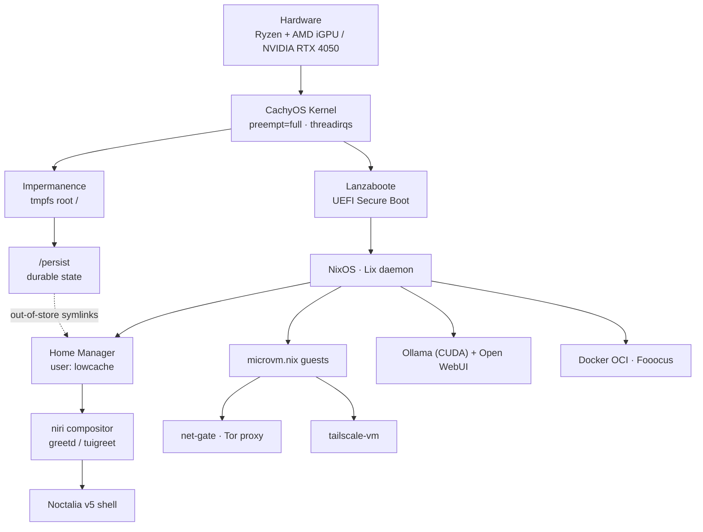

# 🧬 Architecture

Vol[atile] NixOS is a single flake (`flake.nix`) that builds two hosts and two MicroVM runners. The
defining property is **statelessness**: the root filesystem is a `tmpfs` rebuilt clean on every boot,
with all durable data mapped onto `/persist` via `impermanence`.

## The Lix daemon

The reference C++ Nix daemon is replaced by [**Lix**](https://lix.systems) through the `lix-module`
flake input. The flake keeps `inputs.lix.url` tracking Lix `main` with
`inputs.nixpkgs.follows = "nixpkgs"`, and the lock pins exact revisions.

!!! warning "Lix builds from source"
    Because Lix `main` is not published to `cache.lix.systems`, the daemon is **built from source**.
    The `follows`/override pinning must not be removed without re-verifying evaluation
    (`nix eval .#nixosConfigurations.volnix.config.system.build.toplevel.drvPath`).

## Layers

| Layer            | Mechanism                                  | Page                                   |
| :--------------- | :----------------------------------------- | :------------------------------------- |
| Boot & integrity | Lanzaboote UEFI Secure Boot                | [Boot & Secure Boot](boot.md)          |
| Statelessness    | `impermanence` + `/persist` + symlinks     | [Impermanence](impermanence.md)        |
| Performance      | CachyOS kernel + sysctl tuning             | [Kernel & Performance](kernel.md)      |
| Secrets          | `sops-nix` + age                           | [Secrets](secrets.md)                  |
| Isolation        | `microvm.nix` gateways                     | [Networking](../networking/index.md)   |
| Desktop          | niri + Noctalia v5                         | [Desktop](../desktop/index.md)         |
