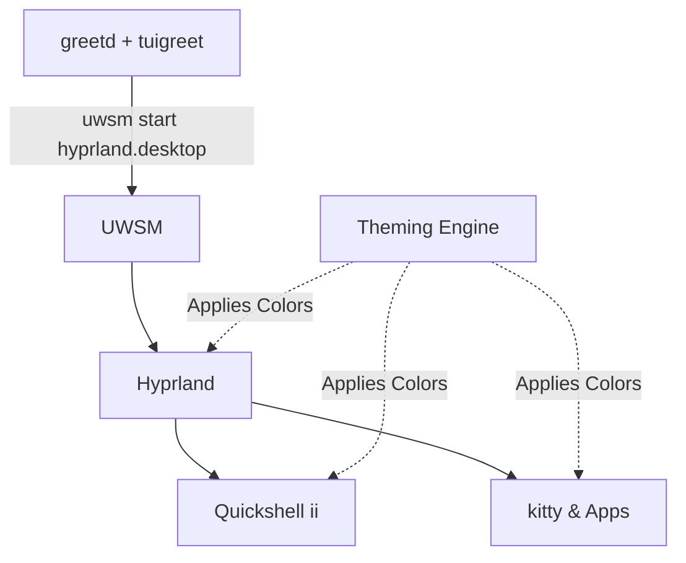

# Desktop Stack Overview 🖥️

The desktop stack utilizes a Wayland ecosystem, customized with a dedicated shell architecture and theming engine.

!!! info
    The desktop session relies on [Hyprland](hyprland.md) operating under the Universal Wayland Session Manager (UWSM). The interface is provided by a custom [Quickshell](quickshell.md) layer and styled using a JSON [Theming Engine](theming.md).

## Architecture

## Core Components

- **[Hyprland & Session](hyprland.md)**: The Wayland compositor, keybind routing, idle/lock management, shaders, and a Quake-style drop-down terminal.
- **[Quickshell Architecture](quickshell.md)**: The "ii" Qt6/QML shell that replaces standard panels and runners. It handles panels, overview, OSD, and notifications.
- **[Theming Engine](theming.md)**: A global JSON-based color scheme generator and applier, accessible via Makefile targets.
